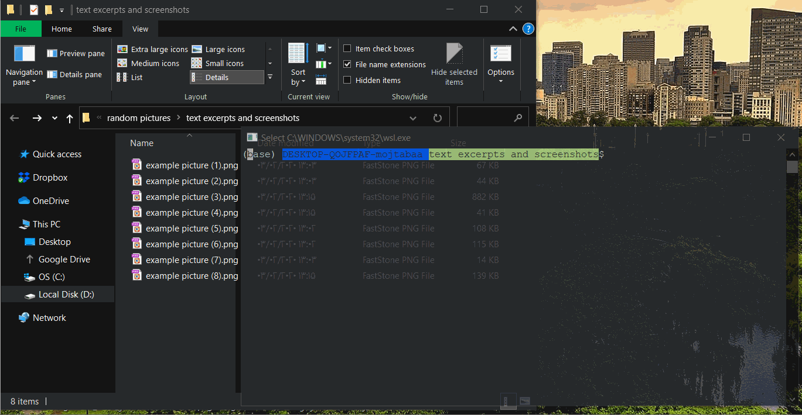

## Take screenshots (e.g while watching your video courses) and then use the ___shotnote___ command to join them together and keep them in a nicely ordered printable document for future reviews!

__Example Usage:__

__How to Install__

It's just a simple script. In order to use it, take these steps:

1. First, install the dependency packages listed below:
* imagemagick (necessary for everyone)
* wkhtmltopdf (necessary for everyone)
* xvfb (only for those not connected to an X server)

2. Then add the content of the script to the .bashrc file in your home directory

3. Run "exec bash" (to re-apply the .bashrc)

4. Your life is easier now! cd (change directory) to the directory in which you keep your screenshots, and run the command "_shotnote_".

__NOTICE__: If you're using Windows, install WSL to have an actual Linux within your Windows(Read more: [Here](https://docs.microsoft.com/en-us/windows/wsl/install-win10))

__NOTICE__: Screenshots MUST be in PNG format for now. JPEG could be supported as well easily, but I didn't need it personally. :smile:

__NOTICE:__ To take screenshots you can use softwares like __SnagIt. SnagIt is recommended specially__ because it provides a myriad of useful options, like taking cropped screenshots, specifying output directory, setting file naming rules, option to work silently, etc.
#
  [ aderchox [at] gmail [dot] com ]
